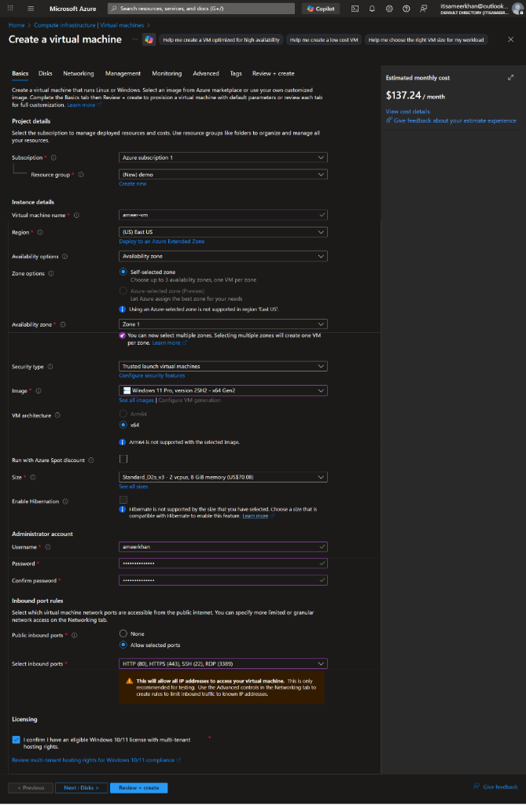
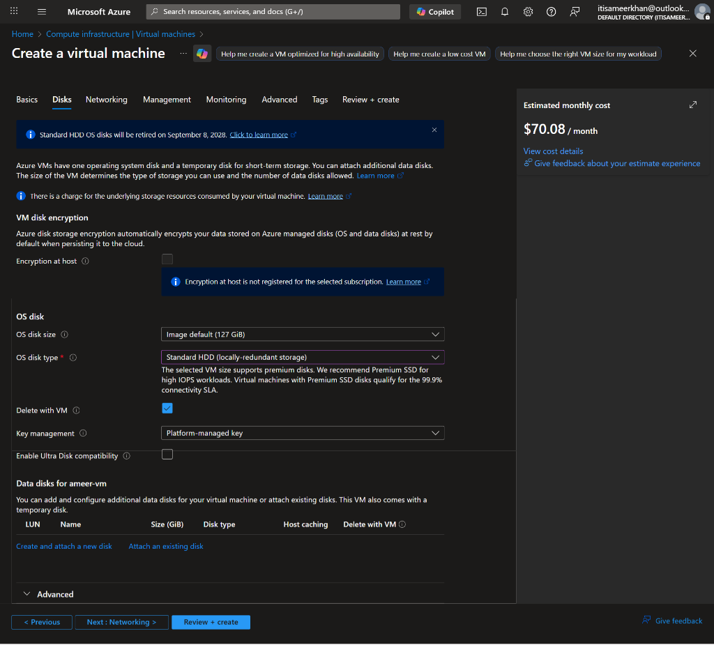
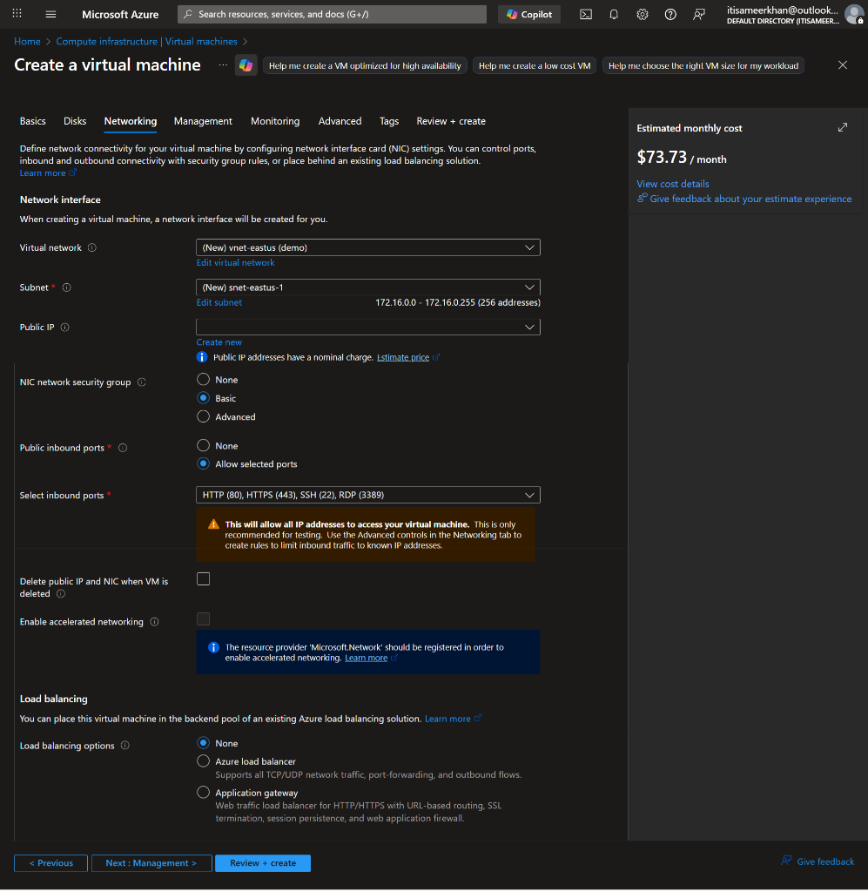
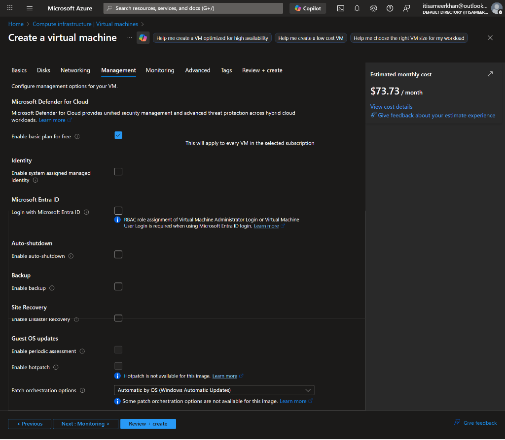
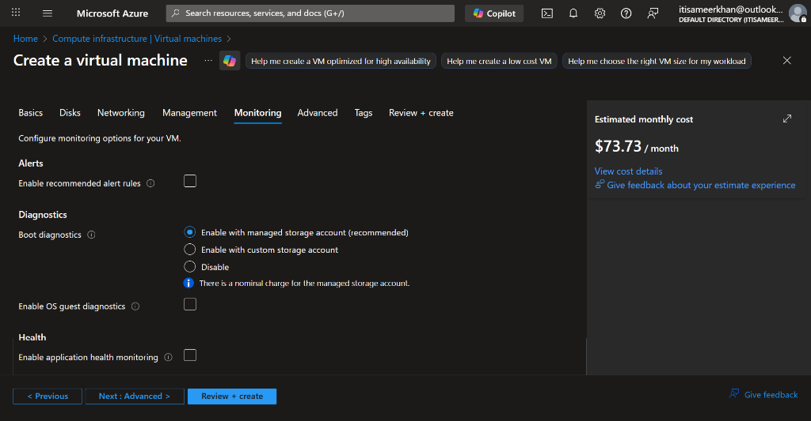
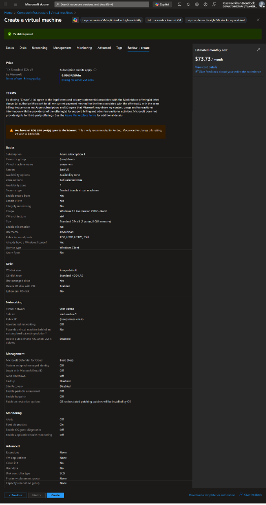

# Azure Virtual Machines (VMs)

## 🖥️ What is an Azure Virtual Machine?
Think of an Azure Virtual Machine like a **remote computer** that you rent from Microsoft. Instead of buying a physical laptop or server and keeping it in your house, you use Microsoft's powerful computers over the internet.

*   **Simple Definition:** Azure Virtual Machines (VMs) are scalable, on-demand cloud resources that provide virtualized computing power. They allow you to deploy, run, and manage applications just like you would on physical hardware.
*   **Total Control:** You can choose the Operating System (Windows or Linux), install any software you like, and control the settings, just like your own PC.

---

## 🎯 Use Cases (Where to use it)
Here are the most common reasons to us a VM:

1.  **Testing and Development:** Create a computer quickly to test code and delete it when you are done.
2.  **Flexible Scaling:** Run applications that might need more power today and less power tomorrow.
3.  **Legacy Applications:** Move old software described for specific setups from your office server to the cloud (Lift and Shift).
4.  **Specialized Software:** Run software that needs specific settings that other cloud services don't allow.

---

## ⭐ Benefits
Why should you choose VMs?

*   **Flexibility:** You have the freedom to choose your Operating System, storage size, and network capabilities.
*   **Scalability:** You can easily increase the number of VMs when you have many users and decrease them when you don't.
*   **Cost-Effective:** You follow a **pay-as-you-go** model. You only pay for the minutes you keep the VM running.

---

## 🧱 Types of Azure Virtual Machine

### General-Purpose VMs
*   **Balanced:** Balanced CPU-to-memory ratio.
*   **Best for:** Ideal for web servers, small databases, and development/testing.

### Compute-Optimized VMs
*   **High CPU:** Higher CPU performance.
*   **Best for:** Best for high-performance computing and batch processing.

### Memory-Optimized VMs
*   **High Memory:** Higher memory-to-CPU ratio.
*   **Best for:** Ideal for relational databases, large caches, and in-memory analytics.

### Storage-Optimized VMs
*   **High Throughput:** High disk throughput and IOPS.
*   **Best for:** Suited for big data, NoSQL databases, and data warehousing.

### GPU-Optimized VMs
*   **Graphics Power:** Equipped with GPUs for heavy graphics processing.
*   **Best for:** Best for AI, machine learning, and 3D visualization.

### High-Performance Computing (HPC) VMs
*   **Speed:** Optimized for high-speed networking and low latency.
*   **Best for:** Designed for scientific modeling, simulations, and advanced computation.

---

## 💰 How do you pay? (Pricing Models)
Azure gives you three main ways to pay:

1.  **Pay-as-you-go (No Commitment):**
    *   *Analogy:* Like a taxi. You pay by the minute/second.
    *   *Best for:* Short tests or unpredictable work.
    *   *Cost:* Standard price.

2.  **Reserved Instances (1 or 3 Year Plan):**
    *   *Analogy:* Like a gym membership or leasing a car. You promise to use it for a long time.
    *   *Best for:* Servers that need to run 24/7 (like a database).
    *   *Cost:* Huge discount (up to **72%** off).

3.  **Spot Instances (Spare Capacity):**
    *   *Analogy:* Like a standby flight ticket. Dealing with empty seats cheaply, but you might get bumped off.
    *   *Best for:* Jobs that can pause or restart (like processing generic data) if Azure needs the computer back.
    *   *Cost:* Cheapest option (up to **90%** off).

---

## 📈 Keeping it Online & Growing

### Availability Sets (Reliability)
This ensures your app stays online even if a server fails or updates.
*   **Simple idea:** Don't put all your eggs in one basket. Azure spreads your VMs across different racks (power/network) so one failure doesn't kill your whole app.

### Virtual Machine Scale Sets (Automatic Growth)
This allows your app to handle more visitors automatically.
*   **Simple idea:** If 1,000 users visit, Azure automatically turns on more VMs. If they leave, it turns them off to save money.

---

---

## 🛠️ Step-by-Step Walkthrough: Creating a VM

Here is a detailed guide on how to configure each tab when creating an Azure Virtual Machine.

### 1. Basics Tab 📝
This is where you configure the core settings of your VM.

*   **Project Details:**
    *   **Subscription:** The account that will be billed.
    *   **Resource Group:** The container for this VM (e.g., `(New) demo`). Think of it as a folder.
*   **Instance Details:**
    *   **Virtual Machine Name:** The name of your server (e.g., `ameer-vm`).
    *   **Region:** The physical location of the datacenter (e.g., `(US) East US`). Choose one close to your users.
    *   **Availability Options:** Settings to ensure your VM stays online.
        *   *Availability Zone:* Protects against datacenter failures by placing VMs in physically separate locations.
    *   **Security Type:** `Trusted launch virtual machines` provides extra security features like secure boot.
    *   **Image:** The Operating System you want to install (e.g., `Windows 11 Pro`).
    *   **Size:** The power of the VM (CPU/RAM).
        *   *Example:* `Standard_D2s_v3` (2 vcpus, 8 GiB memory) costs ~$70.08/month.
*   **Administrator Account:**
    *   **Username/Password:** The credentials you will use to log in to the machine.

### 2. Disks Tab 💾
Here you configure the storage for your VM.

*   **OS Disk Type:**
    *   **Standard HDD:** Cheapest, good for testing.
    *   **Premium SSD:** Best performance, recommended for production workloads.
*   **Delete with VM:** Checking this ensures the disk is deleted when you delete the VM, so you don't keep paying for unused storage.
*   **Encryption:** Azure automatically encrypts data at rest (Platform-managed key).

### 3. Networking Tab 🌐
This controls how your VM communicates with the internet and other resources.

*   **Virtual Network (VNet):** The private network your VM attaches to (e.g., `(New) vnet-eastus`).
*   **Subnet:** A subdivision of the VNet.
*   **Public IP:** The IP address reachable from the internet.
*   **NIC Network Security Group (NSG):** Acts as a firewall.
    *   *Basic:* Allows you to open specific ports.
*   **Select Inbound Ports:**
    *   **RDP (3389):** Required to connect to Windows VMs.
    *   **HTTP (80) / HTTPS (443):** Required if hosting a website.

### 4. Management Tab ⚙️
Configure monitoring and automation features.

*   **Microsoft Defender for Cloud:** Security management system (Basic plan is free).
*   **Auto-shutdown:** *Crucial for saving money!* You can set a time for the VM to turn off automatically every day (e.g., at 7 PM when you leave work).
*   **Backup:** Configure automatic backups to protect your data.

### 5. Monitoring Tab 📊
Set up diagnostics to troubleshoot boot issues.

*   **Boot Diagnostics:** Captures the console output and screenshots of the VM during startup.
    *   *Enable with managed storage account:* Recommended for easily viewing boot errors in the portal.

---
### 6. Review + create Tab ✅
This is the final check before Azure builds your VM.

*   **Validation:** Azure checks if all your settings are correct. You'll see a green "Validation passed" message.
*   **Cost Estimate:** It shows you the estimated cost per hour (e.g., `0.0960 USD/hr`).
*   **Terms:** You agree to the licensing terms.
*   **Verify Details:** Double-check your basics, disk, and networking settings one last time.

---
**Click "Create" to start the deployment!** 🚀
*   It takes a few minutes.
*   Once done, you can click **"Go to resource"** to manage your new Virtual Machine.

