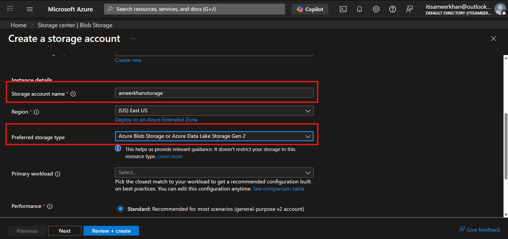
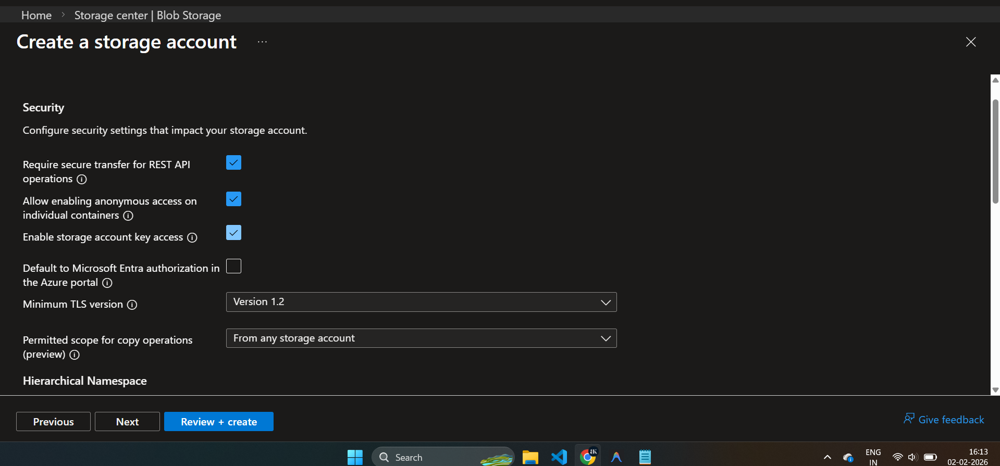

# Blob Storage 

## 🛠️ How to Create Azure Blob Storage

Creating Blob Storage is easy! Follow these steps to get started in the Azure Portal.

### 1️⃣ Search for Storage Accounts 🔍
- Go to the **Azure Portal**.
- In the search bar, type **"Storage accounts"** and select it.

### 2️⃣ Create a New Account ➕
- Click on the **+ Create** button to start setting up a new storage account.

### 3️⃣ Fill in the Basics 📝
You will need to provide some details:
- **Subscription**: Choose your Azure subscription.
- **Resource Group**: Select an existing one or create a new one (e.g., `my-blob-rg`).
- **Storage Account Name**: Enter a unique name (this will be part of your URL).
- **Region**: Choose a location close to you.
- **Performance**: Standard is usually fine.
- **Redundancy**: Choose how your data is replicated (e.g., LRS).

### 4️⃣ Review + Create ✅
- Click **Review + create** to validate your settings.
- Once passed, click **Create** to deploy your storage account!

## Blob Storage resources
Blob Storage offers three types of resources:

* The storage account

* A container in the storage account
* A blob in a container