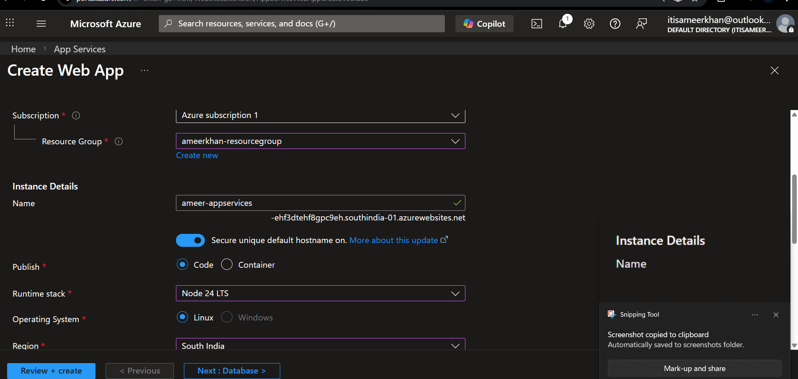
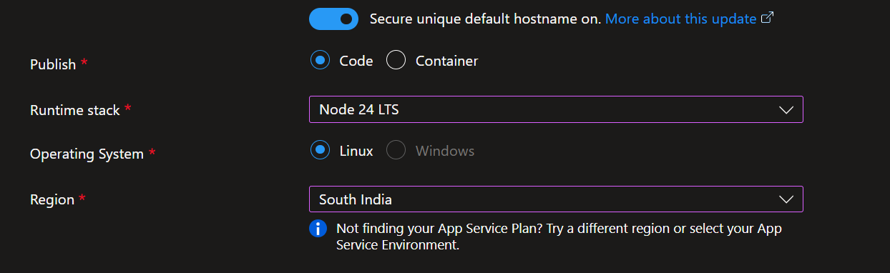
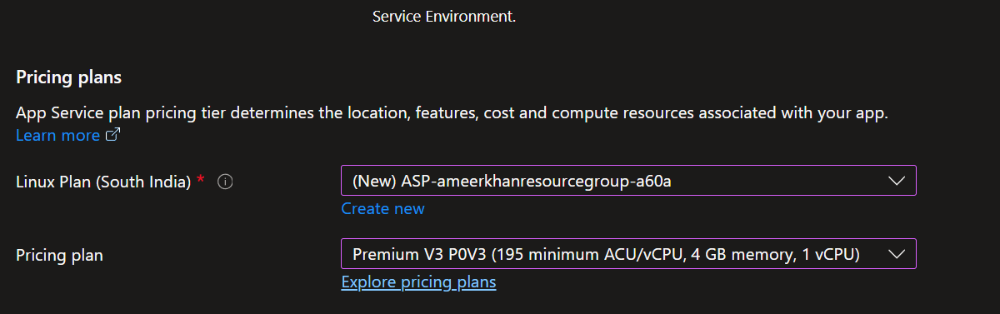
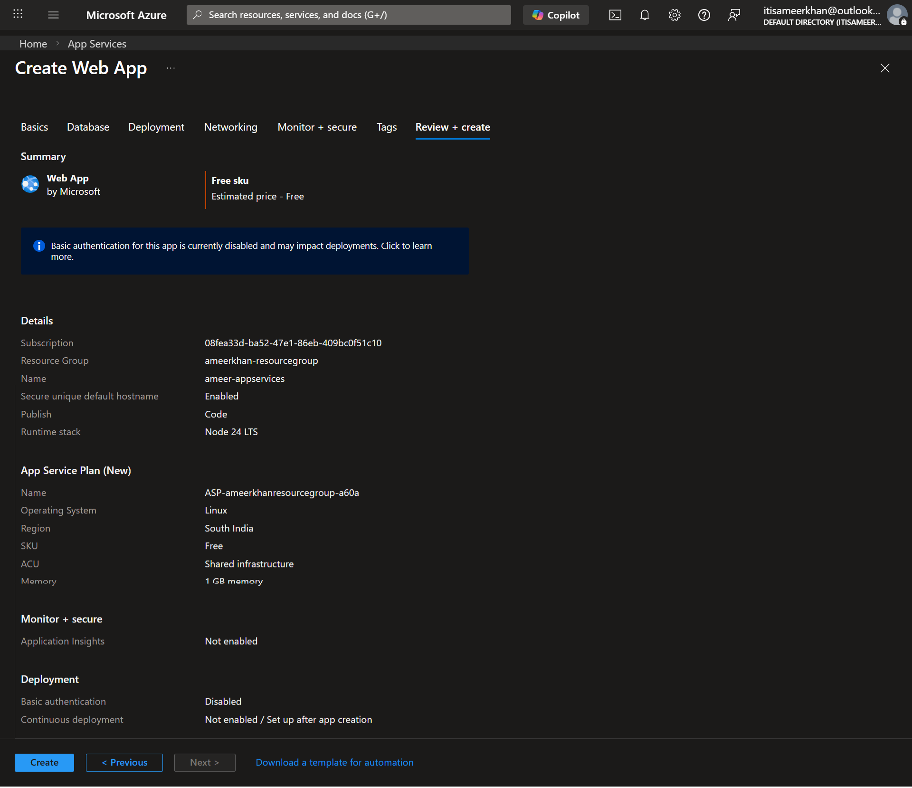
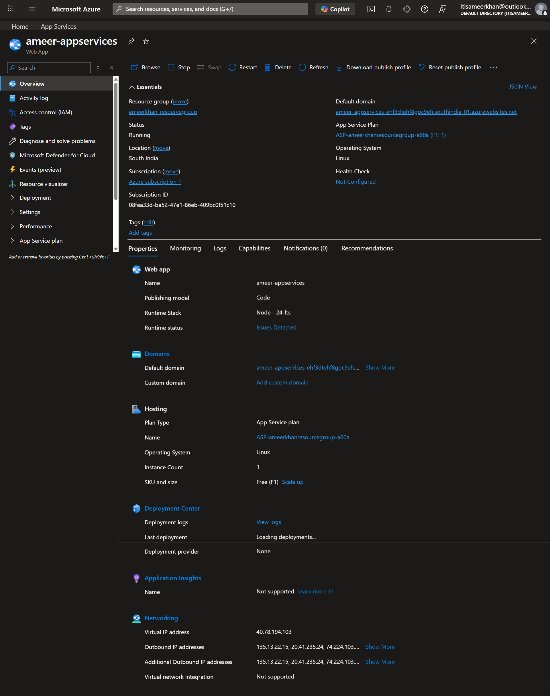

# Azure App Services    

Azure App Service is a fully managed **Platform as a Service (PaaS)** from Microsoft Azure that lets you build, deploy, and scale web applications and APIs without worrying about servers, OS patching, or infrastructure management. 

* You just focus on your code, and Azure handles provisioning, security updates, load balancing, and availability.

* It supports multiple languages like Node.js, .NET, Java, Python, PHP, and frameworks such as Express, Spring Boot, Django, and React (via build output).

* App Service is ideal for production workloads because it provides built-in scaling, monitoring, authentication, SSL, and seamless integration with other Azure services.

## Supported application types

* Web Apps – websites, dashboards, admin panels

* API Apps – backend REST APIs (Node.js, .NET, Java, etc.)

* Mobile Apps – backend services for mobile applications

* Background jobs – using WebJobs for scheduled/triggered tasks

## Languages & runtimes

* Node.js

* .NET / .NET Core

* Java

* Python

* PHP

* Custom containers (Docker)

## Creation of App Service

# Azure App Services

## Overview 

