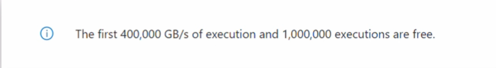
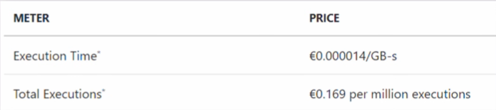
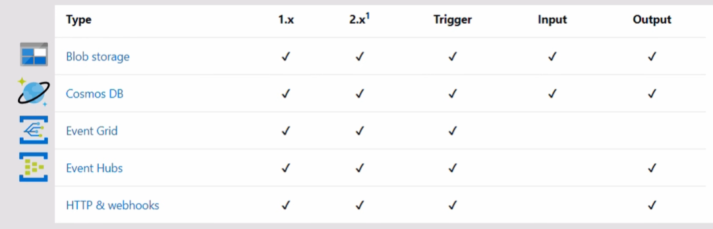
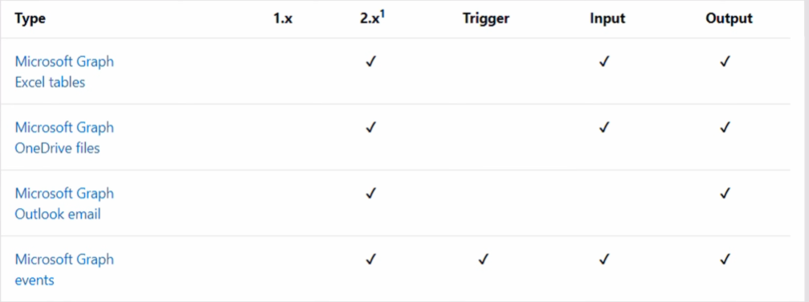
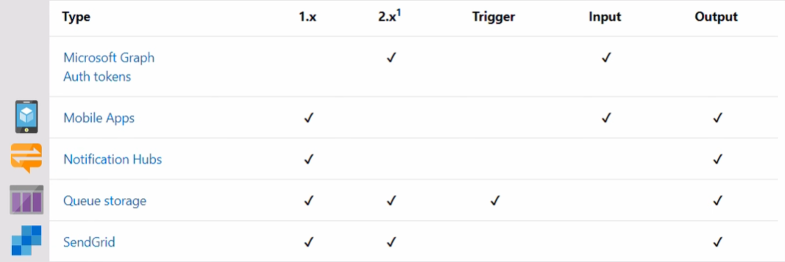
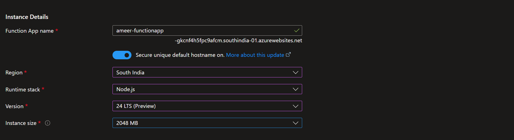

# Azure Functions (serverless)

Azure Functions is a serverless compute service in Microsoft Azure that lets you run small pieces of code (called functions) without creating or managing servers.

* You write only the logic, and Azure automatically handles infrastructure, scaling, and availability.

* Azure Functions are event-driven, meaning they run only when something happens—like an HTTP request, file upload, database change, or scheduled time. **You pay only for the time your code runs, making it cost-effective and highly scalable.**

## ⚡ Key Points (Simple & Clear)

1. **Serverless**
    * No need to manage servers, VMs, or OS. Azure takes care of everything.

2. **Event-driven**
    * Functions run when triggered by events such as:
    * HTTP requests
    * Blob/file uploads

    * Queue messages
    * Database updates
    * Timers (cron jobs)

3. **Auto-scaling**
    * Automatically scales from zero to thousands of executions based on demand.

4. **Pay-per-use**
    * You are charged only for execution time and memory used.

5. **Multiple language support**
    * Supports JavaScript (Node.js), Python, C#, Java, PowerShell, etc.

6. **Easy integration**
    * Works seamlessly with other Azure services like Blob Storage, Cosmos DB, Event Grid, and Service Bus.

7. **Built-in monitoring**
    * Integrated with Application Insights for logs, metrics, and performance tracking.

---

### ⚡ Real-Time Example

* Imagine you have a website where users upload profile images:

* User uploads an image to Azure Blob Storage
* This upload triggers an Azure Function
* The function resizes the image and saves it back
* All happens automatically, without running a server 24/7

### ⚡ Where Azure Functions Are Commonly Used

* Backend APIs (REST endpoints)

* Background jobs
* File processing
* Automation tasks
* Microservices
* Scheduled jobs (daily reports, cleanups)

### ⚡ Trigger and Binding

* **Trigger**: What starts the function (e.g., HTTP request, timer, queue message)

* **Binding**: How the function interacts with other services (e.g., reading from Blob Storage, writing to Cosmos DB)

* **Trigger** → What starts the function

* **Input binding** → What data the function can read
* **Output binding** → Where the function can send data

> Every Azure Function has ONLY ONE trigger

> But it can have many input & output bindings

| Service / Type                        | Trigger | Input Binding | Output Binding | What it is used for      |
| ------------------------------------- | ------- | ------------- | -------------- | ------------------------ |
| **HTTP / Webhook**                    | ✅       | ❌             | ✅              | APIs, backend services   |
| **Timer**                             | ✅       | ❌             | ❌              | Scheduled jobs (cron)    |
| **Blob Storage**                      | ✅       | ✅             | ✅              | File upload / processing |
| **Queue Storage**                     | ✅       | ❌             | ✅              | Background processing    |
| **Service Bus**                       | ✅       | ❌             | ✅              | Enterprise messaging     |
| **Event Grid**                        | ✅       | ❌             | ❌              | Event-based automation   |
| **Event Hubs**                        | ✅       | ❌             | ✅              | Streaming / IoT data     |
| **Cosmos DB**                         | ✅       | ✅             | ✅              | DB change processing     |
| **Table Storage**                     | ❌       | ✅             | ✅              | Read/write table data    |
| **SignalR**                           | ❌       | ✅             | ✅              | Real-time notifications  |
| **SendGrid**                          | ❌       | ❌             | ✅              | Send emails              |
| **Twilio**                            | ❌       | ❌             | ✅              | SMS / WhatsApp           |
| **Notification Hubs**                 | ❌       | ❌             | ✅              | Push notifications       |
| **Kafka**                             | ✅       | ❌             | ✅              | Event streaming          |
| **Durable Functions (Orchestration)** | ✅       | ❌             | ❌              | Workflow orchestration   |

---

## ⭐ Hands on 

| Feature           | Consumption  | Flex Consumption  | Functions Premium | App Service   | Container Apps      |
| ----------------- | ------------ | ----------------- | ----------------- | ------------- | ------------------- |
| Scale to zero     | ✅            | ✅                 | ❌                 | ❌             | ✅                   |
| Cold start        | Yes          | Reduced           | ❌                 | ❌             | Optional            |
| Pay per execution | ✅            | ✅                 | ❌                 | ❌             | ❌                   |
| VNET support      | ❌            | ✅                 | ✅                 | ✅             | ✅                   |
| Always warm       | ❌            | Optional          | ✅                 | ✅             | Optional            |
| Scaling type      | Event-driven | Fast event-driven | Event-driven      | Metrics-based | Event-driven (KEDA) |
| Max scale-out     | 200          | 1000              | 100               | 30            | 300                 |
| Best for          | Small apps   | Modern prod apps  | Enterprise apps   | Legacy apps   | Microservices       |

* Function app name - `ameer-functionapp`

* Runtime stack - `Node.js`
* Version - `24LTS`
* Region - `South India`