# Azure Functions (serverless)

Azure Functions is a serverless compute service in Microsoft Azure that lets you run small pieces of code (called functions) without creating or managing servers.

* You write only the logic, and Azure automatically handles infrastructure, scaling, and availability.

* Azure Functions are event-driven, meaning they run only when something happens—like an HTTP request, file upload, database change, or scheduled time. **You pay only for the time your code runs, making it cost-effective and highly scalable.**

## ⚡ Key Points (Simple & Clear)

1. **Serverless**
    * No need to manage servers, VMs, or OS. Azure takes care of everything.

2. **Event-driven**
    * Functions run when triggered by events such as:
    * HTTP requests
    * Blob/file uploads

    * Queue messages
    * Database updates
    * Timers (cron jobs)

3. **Auto-scaling**
    * Automatically scales from zero to thousands of executions based on demand.

4. **Pay-per-use**
    * You are charged only for execution time and memory used.

5. **Multiple language support**
    * Supports JavaScript (Node.js), Python, C#, Java, PowerShell, etc.

6. **Easy integration**
    * Works seamlessly with other Azure services like Blob Storage, Cosmos DB, Event Grid, and Service Bus.

7. **Built-in monitoring**
    * Integrated with Application Insights for logs, metrics, and performance tracking.

---

### ⚡ Real-Time Example

* Imagine you have a website where users upload profile images:

* User uploads an image to Azure Blob Storage
* This upload triggers an Azure Function
* The function resizes the image and saves it back
* All happens automatically, without running a server 24/7

### ⚡ Where Azure Functions Are Commonly Used

* Backend APIs (REST endpoints)

* Background jobs
* File processing
* Automation tasks
* Microservices
* Scheduled jobs (daily reports, cleanups)

### ⚡ Trigger and Binding

* **Trigger**: What starts the function (e.g., HTTP request, timer, queue message)

* **Binding**: How the function interacts with other services (e.g., reading from Blob Storage, writing to Cosmos DB)

* **Trigger** → What starts the function

* **Input binding** → What data the function can read
* **Output binding** → Where the function can send data

> Every Azure Function has ONLY ONE trigger

> But it can have many input & output bindings

| Service / Type                        | Trigger | Input Binding | Output Binding | What it is used for      |
| ------------------------------------- | ------- | ------------- | -------------- | ------------------------ |
| **HTTP / Webhook**                    | ✅       | ❌             | ✅              | APIs, backend services   |
| **Timer**                             | ✅       | ❌             | ❌              | Scheduled jobs (cron)    |
| **Blob Storage**                      | ✅       | ✅             | ✅              | File upload / processing |
| **Queue Storage**                     | ✅       | ❌             | ✅              | Background processing    |
| **Service Bus**                       | ✅       | ❌             | ✅              | Enterprise messaging     |
| **Event Grid**                        | ✅       | ❌             | ❌              | Event-based automation   |
| **Event Hubs**                        | ✅       | ❌             | ✅              | Streaming / IoT data     |
| **Cosmos DB**                         | ✅       | ✅             | ✅              | DB change processing     |
| **Table Storage**                     | ❌       | ✅             | ✅              | Read/write table data    |
| **SignalR**                           | ❌       | ✅             | ✅              | Real-time notifications  |
| **SendGrid**                          | ❌       | ❌             | ✅              | Send emails              |
| **Twilio**                            | ❌       | ❌             | ✅              | SMS / WhatsApp           |
| **Notification Hubs**                 | ❌       | ❌             | ✅              | Push notifications       |
| **Kafka**                             | ✅       | ❌             | ✅              | Event streaming          |
| **Durable Functions (Orchestration)** | ✅       | ❌             | ❌              | Workflow orchestration   |

---

## ⭐ Hands on 

| Feature           | Consumption  | Flex Consumption  | Functions Premium | App Service   | Container Apps      |
| ----------------- | ------------ | ----------------- | ----------------- | ------------- | ------------------- |
| Scale to zero     | ✅            | ✅                 | ❌                 | ❌             | ✅                   |
| Cold start        | Yes          | Reduced           | ❌                 | ❌             | Optional            |
| Pay per execution | ✅            | ✅                 | ❌                 | ❌             | ❌                   |
| VNET support      | ❌            | ✅                 | ✅                 | ✅             | ✅                   |
| Always warm       | ❌            | Optional          | ✅                 | ✅             | Optional            |
| Scaling type      | Event-driven | Fast event-driven | Event-driven      | Metrics-based | Event-driven (KEDA) |
| Max scale-out     | 200          | 1000              | 100               | 30            | 300                 |
| Best for          | Small apps   | Modern prod apps  | Enterprise apps   | Legacy apps   | Microservices       |

* Function app name - `ameer-functionapp`

* Runtime stack - `Node.js`
* Version - `24LTS`
* Region - `South India`

### ⚡ Storage Account 

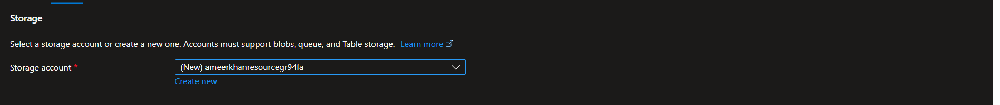

Azure Functions require a Storage Account because Azure uses it internally to manage and run functions reliably. Even if your function code does not directly read or write files, the Functions runtime still depends on storage to keep track of configuration, execution state, triggers, and scaling information. Without a storage account, Azure would not be able to coordinate function execution, handle events correctly, or scale functions automatically.

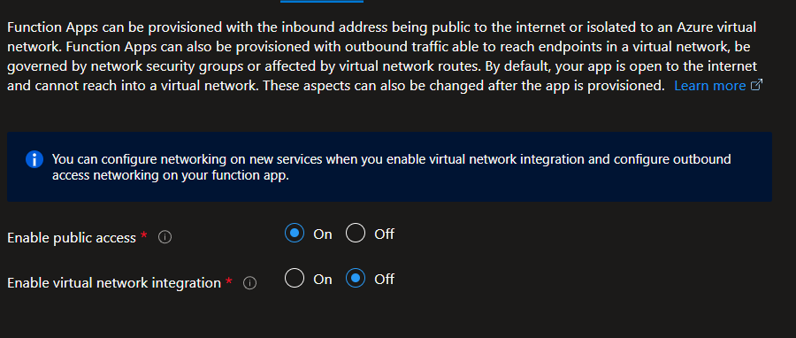

In an Azure Function App, networking settings control how your functions are accessed and how they access other resources.. You can decide whether your function is publicly reachable from the internet and whether it can securely connect to resources inside an Azure Virtual Network (VNet). By default, a Function App is publicly accessible and cannot access private resources inside a VNet unless you enable integration.

### Enable public access (On/Off)

* **On**: Your Function App has a public internet endpoint. Anyone (with the correct URL and permissions) can call HTTP-triggered functions.

* **Off**: The Function App is not accessible from the public internet. It can be accessed only from private networks or approved endpoints (used for high-security apps).

### Enable virtual network integration (On/Off)

* **On**: The Function App can connect to resources inside a VNet, such as private databases, private storage accounts, or internal APIs.

* **Off**: The Function App can only reach public internet resources and cannot access private VNet resources.

## ⚡Durable Functions

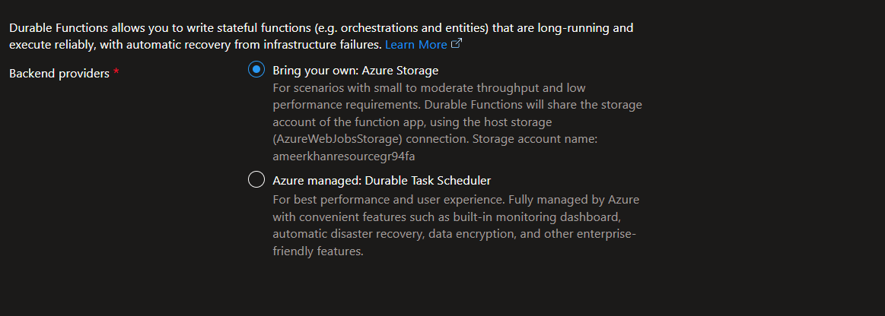

Durable Functions let you build stateful, long-running workflows (orchestrations and entities) that run reliably even if there are failures or restarts. To make this possible, Azure needs a backend provider to store workflow state, execution history, and checkpoints. This screen lets you choose where and how that state is stored and managed.

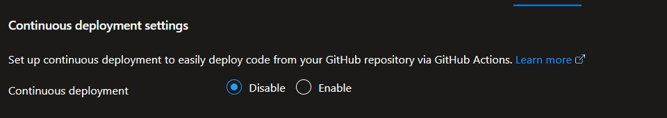

Continuous Deployment (CD) in an Azure Function App allows your function code to be automatically deployed from a GitHub repository whenever you push changes. This is done using GitHub Actions, so you don’t have to manually upload or redeploy code each time you make an update. It helps keep your deployed function always in sync with your source code.

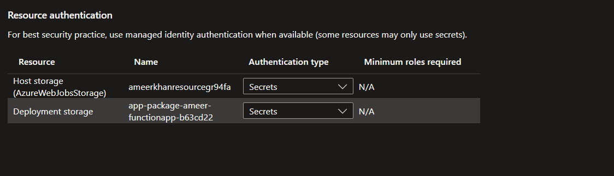

Resource authentication in an Azure Function App defines how the function securely connects to required Azure resources, especially storage accounts. Azure recommends using Managed Identity where possible, but some resources still use secrets (keys/connection strings). This screen shows which resources your Function App uses and what authentication method is configured for each one.

## ⭐ Creating Functions in VS Code

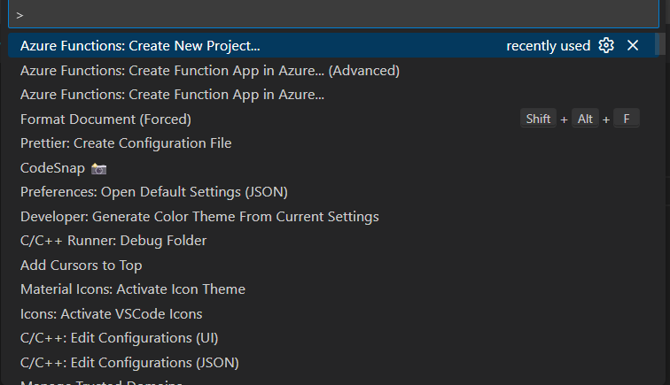
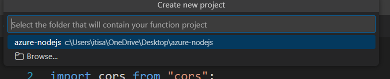
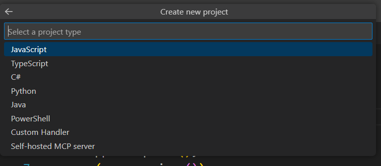
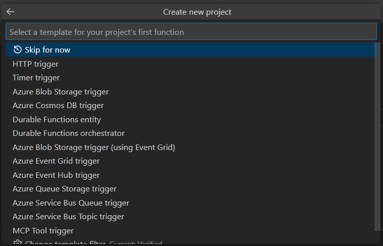
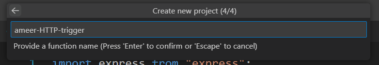
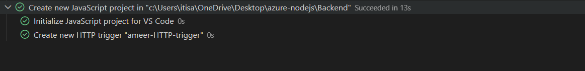

| **Trigger Name**                    | **What starts the function**  | **Typical Use Case**    | **Real-world example**        |
| ----------------------------------- | ----------------------------- | ----------------------- | ----------------------------- |
| **HTTP trigger**                    | HTTP request (GET/POST)       | APIs, backend services  | Call API from browser/Postman |
| **Timer trigger**                   | Time schedule (cron)          | Scheduled jobs          | Run cleanup every night       |
| **Azure Blob Storage trigger**      | Blob upload/change            | File processing         | Resize uploaded image         |
| **Azure Blob trigger (Event Grid)** | Blob event via Event Grid     | Large-scale blob events | Process millions of uploads   |
| **Azure Queue Storage trigger**     | Message in storage queue      | Background jobs         | Order processing              |
| **Azure Cosmos DB trigger**         | Data change in Cosmos DB      | DB change reactions     | Send email on new user        |
| **Azure Event Grid trigger**        | Event from Azure services     | Event-driven automation | VM created → run script       |
| **Azure Event Hub trigger**         | Event stream message          | Streaming / IoT data    | Process sensor data           |
| **Azure Service Bus Queue trigger** | Message in Service Bus queue  | Enterprise messaging    | Payment processing            |
| **Azure Service Bus Topic trigger** | Message in topic subscription | Pub-Sub systems         | Notify multiple services      |
| **Durable Functions orchestrator**  | Started by client or trigger  | Workflows               | Multi-step order process      |
| **Durable Functions entity**        | Called by orchestrator        | State management        | Counter, inventory            |
| **MCP Tool trigger**                | Tool-based automation         | AI / tool integrations  | Agent-driven tasks            |
