# Cosmos DB


Azure Cosmos DB is a fully managed NoSQL database service provided by Microsoft in the Microsoft Microsoft Azure cloud platform. It is designed to store and manage large amounts of data across the globe with high availability and low latency. Cosmos DB supports multiple data models like document, key-value, graph, and column-family, which makes it flexible for modern applications such as web apps, mobile apps, IoT systems, and real-time analytics. It automatically scales based on demand and ensures high performance without manual infrastructure management.


## 1️⃣ Turnkey Global Distribution

Azure Cosmos DB provides automatic multi-region data distribution. This means your data can be replicated across multiple countries or regions without manual setup. Businesses do not need to configure complex replication systems — Azure handles it internally.

### Key Points:

* 🌍 Automatically replicates data to multiple regions.
* 🔄 No manual configuration required.
* 🚀 Improves performance for global users.
* 🛡️ Helps in disaster recovery and fault tolerance.

---

## 2️⃣ Regional Presence (54+ Regions)

Azure Cosmos DB is available in more than 54 Azure regions worldwide. This wide presence ensures that applications can serve users from the nearest location, reducing delay and improving experience.

### Key Points:

* 🌎 Available in 54+ global regions.
* ⚡ Users access data from the closest region.
* 📈 Supports global business expansion.
* 🔁 Enables multi-region failover.

---

## 3️⃣ Always On (99.999% Availability)

Cosmos DB guarantees 99.999% availability for both read and write operations. This ensures business continuity and minimal downtime.

### Key Points:

* 🔓 99.999% uptime guarantee.
* 📖 Read and ✍️ write operations are both covered.
* 🏢 Suitable for mission-critical applications.
* 🛠️ Backed by Microsoft SLA (Service Level Agreement).

---

## 4️⃣ Elastic Scale

Cosmos DB can handle traffic from thousands to hundreds of millions of requests per second. It automatically scales based on application demand.

### Key Points:

* 📊 Handles very high traffic.
* 🔄 Auto-scale feature available.
* 💼 Ideal for growing startups and large enterprises.
* 💰 Pay only for the throughput you configure.

---

## 5️⃣ Low Latency Guarantee

Cosmos DB guarantees less than 10 milliseconds read and write latency for the 99th percentile. This means almost all user requests are processed extremely fast.

### Key Points:

* ⚡ Under 10ms response time.
* 📱 Great for real-time apps (chat, gaming, e-commerce).
* 📈 Consistent performance even at high load.
* 🌍 Fast response globally.

---

## 6️⃣ Consistency Options

Cosmos DB provides multiple consistency models. Organizations can choose the balance between strong consistency (accurate data everywhere) and performance.

### Key Points:

* 🧩 Five consistency levels available.
* ⚖️ Balance between accuracy and speed.
* 🏦 Strong consistency for banking apps.
* 📱 Eventual consistency for social media apps.

---

## 7️⃣ No Schema or Index Management

Cosmos DB is schema-agnostic, meaning you do not need to define a fixed table structure in advance. It also automatically indexes data.

### Key Points:

* 📂 No predefined schema required.
* 🔍 Automatic indexing enabled.
* 🛠️ Reduces database administration effort.
* 🚀 Faster development and flexibility.

---


## ⭐ Key Features 

## 1️⃣ SQL (Core API)

The SQL API (also called Core API) is the primary and most commonly used API in Azure Cosmos DB. It allows developers to store data in JSON format and query it using SQL-like syntax.

### Key Points:

* 📄 Stores data as JSON documents.
* 🔍 Uses SQL-like queries (easy for SQL developers).
* 🚀 Most commonly used Cosmos DB API.
* 💼 Suitable for web and mobile applications.

---

## 2️⃣ Cassandra API

This API allows applications that are built using Apache Cassandra to work directly with Cosmos DB without major changes.

### Key Points:

* 🔄 Compatible with Cassandra applications.
* 📊 Designed for high scalability.
* 🏢 Used in large distributed systems.
* 💡 Helps migrate Cassandra workloads to Azure easily.

---

## 3️⃣ MongoDB API

This API makes Cosmos DB compatible with MongoDB applications. Developers can use existing MongoDB drivers and tools.

### Key Points:

* 🍃 Supports MongoDB queries and drivers.
* 🔁 Easy migration from MongoDB to Cosmos DB.
* 📦 Works with existing MongoDB applications.
* 🚀 Ideal for startups already using MongoDB.

---

## 4️⃣ Gremlin API (Graph API)

Gremlin API is used for graph-based data. Graph databases are useful when relationships between data are important (like social networks or recommendation systems).

### Key Points:

* 🔗 Manages highly connected data.
* 👥 Useful for social media and fraud detection.
* 📈 Great for recommendation engines.
* 🧠 Uses Gremlin query language.

---

## 5️⃣ Azure Table Storage API

This API provides compatibility with Azure Table Storage. It is useful for simple key-value storage scenarios.

### Key Points:

* 🗂️ Stores key-value structured data.
* ⚡ Lightweight and cost-effective.
* 🔄 Easy migration from Azure Table Storage.
* 🏢 Suitable for simple applications and logs.

---


## ⭐ CosmosDB Structure


This image explains the **internal structure of Azure Cosmos DB** and how data components are organized depending on the API you choose. It shows the hierarchy starting from the account level down to containers and items, and also highlights additional features available inside containers.

Let’s understand it in a simple HR-friendly way.

---

## 🔹 1️⃣ Database Account → Databases → Containers

At the top level, we have the **Cosmos DB Account** (also called Database Account). Inside that account, we create **Databases**, and inside each database, we create **Containers**.

This follows a clear hierarchy:

* 📦 **Database Account**
* 📁 **Databases**
* 🗂️ **Containers**
* 📄 **Items**

This structure helps organize data in a scalable and secure way.

---

## 🔹 2️⃣ Container (Very Important Component)

A **Container** is the most important logical unit in Cosmos DB because:

* It stores your actual data (items).
* It manages throughput (RU/s).
* It handles partitioning.
* It supports server-side logic.

### Inside a Container, we can have:

* ⚙️ **Stored Procedures** – Predefined backend logic stored in the database.
* 🧩 **User-Defined Functions (UDFs)** – Custom functions used inside queries.
* 🔔 **Triggers** – Automatically execute before or after data operations.
* 🔄 **Merge Procedures** – Used for merging operations.
* ⚠️ **Conflicts** – Handled in multi-region write scenarios.
* 📄 **Items** – Actual records stored inside the container.

👉 Important: Containers are where performance and scaling decisions happen.

---

## 🔹 3️⃣ Container Representation Based on API

Depending on which API you select in Cosmos DB, a container is represented differently:

* 📄 **Collection** → SQL API or MongoDB API
* 📊 **Table** → Table API
* 🔗 **Graph** → Gremlin API
* … (other types depending on API)

So the name changes, but logically it is still a container.

---

## 🔹 4️⃣ Items (Actual Data Records)

Items are the actual data stored inside a container.

Depending on the API, items are called different things:

* 📄 **Document** → SQL / MongoDB API
* 📊 **Row** → Table API
* 🔵 **Node** → Graph API
* ➖ **Edge** → Graph API (relationship between nodes)

Again, the terminology changes based on API, but functionally they are individual data records.

---

## ⭐ Request Units (RU)

Request Units (RU/s) in Azure Cosmos DB represent the measure of performance and throughput. Instead of charging separately for CPU, memory, and disk usage, Cosmos DB uses Request Units to combine all resource consumption into a single unit. Every operation (read, write, query) consumes a certain number of RUs. The more complex the operation, the more RUs it consumes. This model helps organizations plan performance and cost in a predictable way.

Azure Cosmos DB measures the cost of all database operations using Request Units (RUs). Instead of charging separately for CPU, memory, storage, and networking, Cosmos DB combines everything into a single measurement called RU. It also explains that RU per second (RU/s) acts like a “currency” for database throughput — meaning it represents how much work your database can handle every second.


## ⭐ Partitions 

**Partitions in Azure Cosmos DB** are used to divide and distribute data inside a container so that the database can scale efficiently. When the amount of data or traffic increases, Cosmos DB automatically spreads the data across multiple partitions. This ensures high performance, better availability, and horizontal scaling. Without partitioning, handling large-scale applications would be difficult and slow.


---

### What is Partitioning?

Partitioning means:

* Dividing container data into smaller groups.
* Distributing data across multiple storage units.
* Improving scalability and performance.

It helps Cosmos DB handle:

* 📈 Large datasets
* 🚀 High traffic
* 🌍 Global applications

---

### 1️⃣ Logical Partition

A **Logical Partition** is created based on the **Partition Key** you choose while creating the container.

All items with the same partition key value belong to the same logical partition.

### Example:

If partition key = `country`

* All items with `country = India` → One logical partition
* All items with `country = USA` → Another logical partition

### Key Points:

* 🔑 Created using partition key value.
* 📦 Groups related data together.
* ⚖️ Each logical partition has a size limit (20 GB).
* 🚀 Important for query performance.
* 🎯 Choosing the correct partition key is critical.

---

### 2️⃣ Physical Partition

A **Physical Partition** is the actual storage unit managed internally by Cosmos DB.

Cosmos DB automatically:

* Creates physical partitions.
* Distributes logical partitions across them.
* Balances load when data grows.

You do NOT control physical partitions — Azure manages them automatically.

### Key Points:

* 🖥️ Actual storage and compute unit.
* ⚙️ Automatically managed by Azure.
* 📊 Each physical partition has throughput limits.
* 🔄 Automatically splits when storage or RU/s increases.

---

### Logical vs Physical Partition (Simple Comparison)

| Logical Partition            | Physical Partition                 |
| ---------------------------- | ---------------------------------- |
| Based on partition key value | Based on storage & throughput      |
| Visible to developer         | Managed internally                 |
| Groups related items         | Stores multiple logical partitions |
| Max 20 GB per key            | Automatically splits when needed   |

---

### Why Partitioning is Important

Partitioning helps in:

* 📈 Horizontal scaling
* ⚡ Faster query performance
* 💰 Efficient RU usage
* 🌍 Global distribution support
* 🛡️ High availability

---

### Simple Real-Time Example

Imagine an e-commerce app:

Partition key = `userId`

* All orders of one user go to one logical partition.
* Cosmos DB distributes users across physical partitions.
* If traffic increases, Cosmos DB automatically adds more physical partitions.

This ensures performance remains stable even with millions of users.

---

## ⭐ SQL API

The SQL API in Azure Cosmos DB (also called the Core API) is the most commonly used API to interact with Cosmos DB. It allows developers to store data in JSON document format and query it using a SQL-like language. Even though Cosmos DB is a NoSQL database, the SQL API makes it easy for developers who already know SQL to work with it. It is highly scalable, globally distributed, and optimized for modern web and mobile applications.

```sql
SELECT * FROM c WHERE c.city = "Hyderabad"
```

```json
{
  "id": "101",
  "name": "Ameer",
  "city": "Hyderabad",
  "age": 25
}
```


---

## ⭐ Azure cosmosdb demo

### ⚡ Create a cosmosdb account

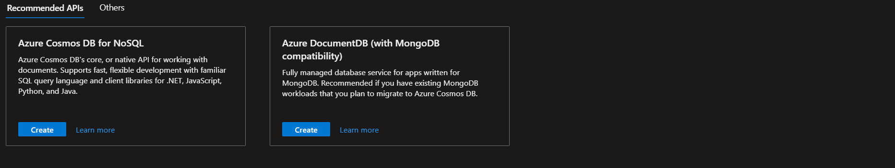


### ⚡ Azure Cosmos DB for NoSQL

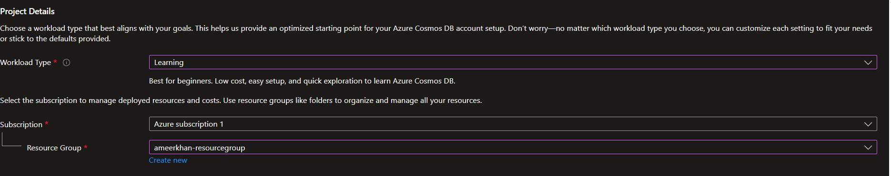

### **Workload Type**

Workload Type defines how Azure configures and optimizes your Cosmos DB account during setup. In your screenshot, it is set to **Learning**, which is designed for beginners, low-cost usage, and quick experimentation. It provides simple default settings suitable for practice environments.

| Setting       | Selected Value | Purpose                                    |
| ------------- | -------------- | ------------------------------------------ |
| Workload Type | Learning       | Optimized for beginners and low-cost setup |

---

### **Subscription**

Subscription determines the billing account under which your Azure resources are created and managed. In your case, it is set to **Azure subscription 1**, meaning all usage and charges for this Cosmos DB account will be tracked under this subscription.

| Setting      | Selected Value       | Purpose                                             |
| ------------ | -------------------- | --------------------------------------------------- |
| Subscription | Azure subscription 1 | Manages billing, usage tracking, and access control |

---

### **Resource Group**

Resource Group is a logical container that organizes related Azure resources for easier management. In your setup, it is set to **ameerkhan-resourcegroup**, which means this Cosmos DB account will be grouped with other resources inside that project container.

| Setting        | Selected Value          | Purpose                                          |
| -------------- | ----------------------- | ------------------------------------------------ |
| Resource Group | ameerkhan-resourcegroup | Organizes and manages related resources together |

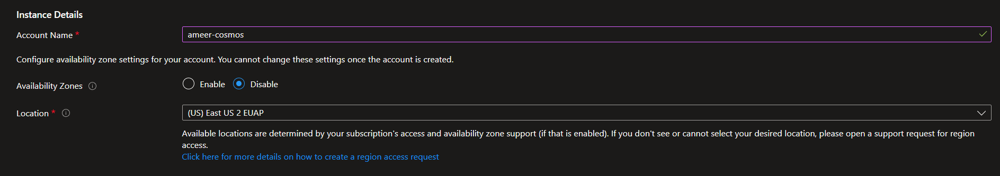

### **Account Name**

Account Name uniquely identifies your Cosmos DB account in Azure. In your setup, it is set to **ameer-cosmos**, which will be used as the global endpoint name to access the database. This name must be unique across Azure because it becomes part of the database URL.

| Setting      | Selected Value | Purpose                                                   |
| ------------ | -------------- | --------------------------------------------------------- |
| Account Name | ameer-cosmos   | Unique identifier and endpoint name for Cosmos DB account |

---

### **Availability Zones**

Availability Zones provide higher availability by distributing your database across separate physical locations within a region. In your setup, it is set to **Disable**, which means the account will run in a single zone. This is fine for learning or testing but not ideal for production systems that require high availability.

| Setting            | Selected Value | Purpose                                                            |
| ------------------ | -------------- | ------------------------------------------------------------------ |
| Availability Zones | Disable        | Runs database in a single zone (lower cost, suitable for learning) |

---

### **Location**

Location defines the Azure region where your Cosmos DB account will be deployed. In your setup, it is set to **(US) East US 2 EUAP**, which means your data will be stored and processed in that region. Choosing a region closer to your users improves performance and reduces latency.

| Setting  | Selected Value      | Purpose                                            |
| -------- | ------------------- | -------------------------------------------------- |
| Location | (US) East US 2 EUAP | Determines where the database is physically hosted |

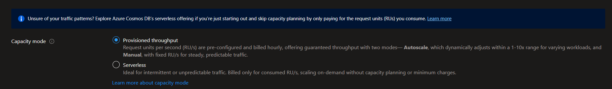

### **Capacity Mode**

Capacity Mode defines how Azure Cosmos DB will handle performance (Request Units) and how you will be billed. In your screenshot, the option **Provisioned Throughput** is selected. This means you predefine the number of RU/s (Request Units per second), and Azure guarantees that performance level. It is suitable when your traffic is steady and predictable.

| Setting       | Selected Value         | Purpose                                         |
| ------------- | ---------------------- | ----------------------------------------------- |
| Capacity Mode | Provisioned Throughput | Pre-configured RU/s with guaranteed performance |

---

### **Provisioned Throughput**

Provisioned Throughput allows you to decide how many RU/s your database should handle. You pay hourly based on the RU/s you configure. It supports two modes: Manual (fixed RU/s) and Autoscale (automatically adjusts RU/s based on traffic).

| Feature   | Meaning                    | Best For                     |
| --------- | -------------------------- | ---------------------------- |
| Manual    | Fixed RU/s                 | Stable, predictable traffic  |
| Autoscale | RU/s adjusts automatically | Variable but regular traffic |

---

### **Serverless**

Serverless mode is ideal when traffic is unpredictable or low. Instead of predefining RU/s, you only pay for the RUs you actually consume. It automatically scales based on demand and does not require capacity planning.

| Feature    | Meaning                   | Best For                               |
| ---------- | ------------------------- | -------------------------------------- |
| Serverless | Pay only for consumed RUs | Testing, development, low traffic apps |

---

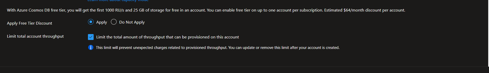

### **Apply Free Tier Discount**

The Free Tier option allows you to use Azure Cosmos DB with limited resources at no cost. As shown in your screenshot, selecting **Apply** gives you up to 1000 RU/s and 25 GB of storage free for one account per subscription. This is ideal for learning, testing, or small applications, and it helps reduce your monthly cost.

| Setting   | Selected Value | Purpose                                   |
| --------- | -------------- | ----------------------------------------- |
| Free Tier | Apply          | Provides 1000 RU/s and 25 GB storage free |

---

### **Limit Total Account Throughput**

This option allows you to set a maximum limit on the RU/s that can be provisioned for the account. It helps prevent unexpected charges by restricting how much throughput can be configured. You can modify or remove this limit later if needed.

| Setting          | Selected Value | Purpose                                                |
| ---------------- | -------------- | ------------------------------------------------------ |
| Throughput Limit | Enabled        | Prevents unexpected high billing due to increased RU/s |

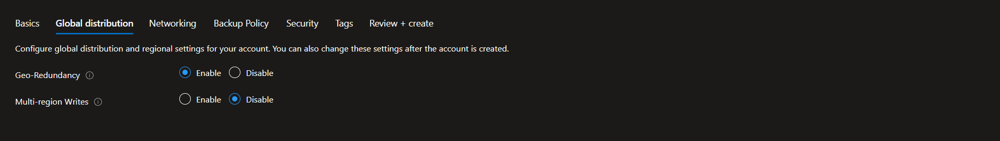

### **Geo-Redundancy**

Geo-Redundancy ensures that your data is replicated to another Azure region for disaster recovery. In your screenshot, it is set to **Enable**, which means Azure will maintain a backup copy of your data in a different geographical region. This improves reliability and protects against regional outages.

| Setting        | Selected Value | Purpose                                           |
| -------------- | -------------- | ------------------------------------------------- |
| Geo-Redundancy | Enable         | Protects data by replicating it to another region |

---

### **Multi-Region Writes**

Multi-Region Writes allows your application to write data to multiple regions simultaneously. In your setup, it is set to **Disable**, which means write operations will happen only in the primary region, while other regions (if added) will handle read operations. This setup is simpler and commonly used for learning or basic applications.

| Setting             | Selected Value | Purpose                                                            |
| ------------------- | -------------- | ------------------------------------------------------------------ |
| Multi-Region Writes | Disable        | Allows writes only in the primary region for simpler configuration |

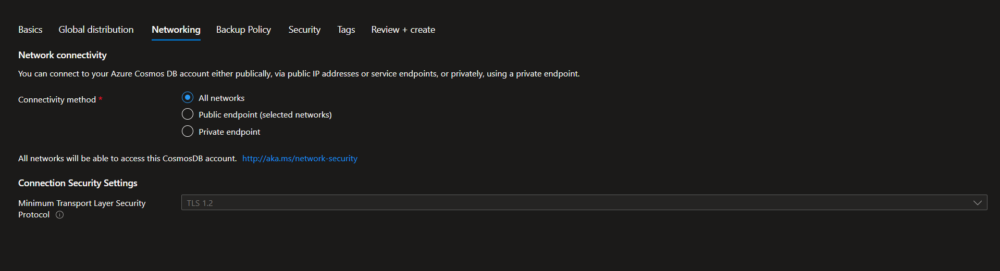

### **Connectivity Method**

Connectivity Method defines how applications can access your Azure Cosmos DB account. In your screenshot, **All networks** is selected, which means the database can be accessed from any public network over the internet (with proper keys or credentials). This is simple and suitable for learning or development, but for production environments, restricted or private access is recommended for better security.

| Setting             | Selected Value | Purpose                               |
| ------------------- | -------------- | ------------------------------------- |
| Connectivity Method | All networks   | Allows access from any public network |

---

### **Minimum Transport Layer Security (TLS)**

Minimum TLS defines the minimum security protocol required for connections to your Cosmos DB account. It is set to **TLS 1.2**, which ensures encrypted and secure communication between your application and the database. TLS protects data while it is being transmitted over the network.

| Setting     | Selected Value | Purpose                                |
| ----------- | -------------- | -------------------------------------- |
| Minimum TLS | TLS 1.2        | Ensures secure encrypted communication |

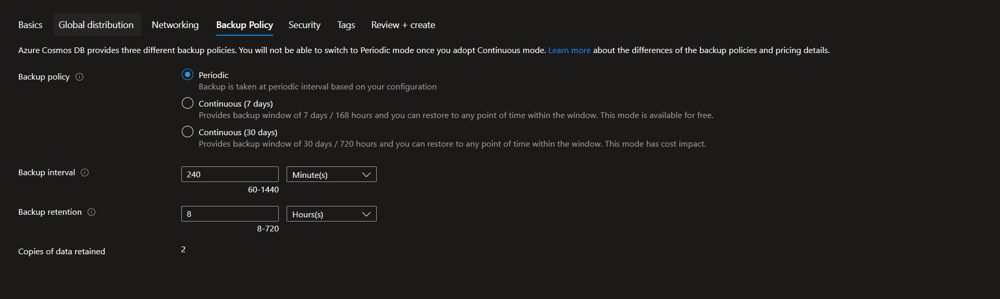

### **Backup Policy**

Backup Policy defines how Azure Cosmos DB creates and stores backups of your data. In your setup, **Periodic** backup is selected, which means backups are taken automatically at fixed time intervals based on your configuration. This is the default and cost-effective option, commonly used for learning and standard workloads.

| Setting       | Selected Value | Purpose                              |
| ------------- | -------------- | ------------------------------------ |
| Backup Policy | Periodic       | Takes backups at scheduled intervals |

---

### **Backup Interval**

Backup Interval specifies how often Azure takes a backup. In your configuration, it is set to **240 minutes**, meaning a backup is created every 4 hours.

| Setting         | Selected Value | Purpose                      |
| --------------- | -------------- | ---------------------------- |
| Backup Interval | 240 Minutes    | Creates backup every 4 hours |

---

### **Backup Retention**

Backup Retention defines how long the backups are stored before being deleted. In your setup, it is set to **8 hours**, which means backups will be retained for 8 hours before being removed automatically.

| Setting          | Selected Value | Purpose                        |
| ---------------- | -------------- | ------------------------------ |
| Backup Retention | 8 Hours        | Stores backup data for 8 hours |

---

### **Copies of Data Retained**

This setting shows how many backup copies are maintained based on your interval and retention settings. In your case, **2 copies** of the data will be retained.

| Setting         | Value | Purpose                                                |
| --------------- | ----- | ------------------------------------------------------ |
| Copies Retained | 2     | Number of backup copies stored within retention window |

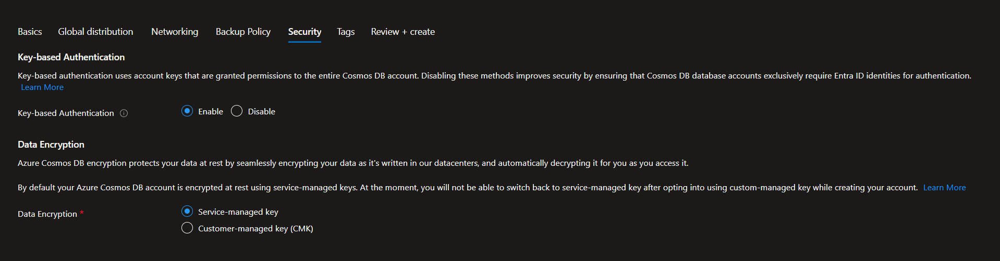

### **Key-Based Authentication**

Key-Based Authentication allows access to your Cosmos DB account using account keys (primary and secondary keys). In your setup, it is set to **Enable**, which means applications can connect using these keys. This method is simple and commonly used for development, but for higher security in production, identity-based authentication (Microsoft Entra ID) is recommended.

| Setting                  | Selected Value | Purpose                          |
| ------------------------ | -------------- | -------------------------------- |
| Key-Based Authentication | Enable         | Allows access using account keys |

---

### **Data Encryption**

Data Encryption protects your data while it is stored in Azure data centers. In your configuration, **Service-managed key** is selected, which means Azure automatically manages the encryption keys for you. This is the default and simplest option. The alternative, Customer-Managed Key (CMK), allows you to control your own encryption keys for advanced security requirements.

| Setting         | Selected Value      | Purpose                                     |
| --------------- | ------------------- | ------------------------------------------- |
| Data Encryption | Service-managed key | Azure manages encryption keys automatically |


### ⚡ Creating a container

### **Database ID**

Database ID is the name of the database you are creating inside your Cosmos DB account. In your setup, it is set to **demo-database**, which means all containers you create under it will belong to this database. A database is mainly used to logically group related containers.

| Setting     | Selected Value | Purpose                                       |
| ----------- | -------------- | --------------------------------------------- |
| Database ID | demo-database  | Logical container to group related containers |

---

### **Container ID**

Container ID is the name of the container where your actual data (documents/items) will be stored. In your setup, it is **demo-container**. A container is the most important unit because it stores data and manages throughput and partitioning.

| Setting      | Selected Value | Purpose                              |
| ------------ | -------------- | ------------------------------------ |
| Container ID | demo-container | Stores documents and manages scaling |

---

### **Partition Key**

Partition Key decides how your data will be distributed inside the container. In your setup, it is set to **/demo-partition**, which means Cosmos DB will look at the `demo-partition` field inside each document to group and distribute data. This key is very important for performance and scalability.

Example document:

```json
{
  "id": "1",
  "demo-partition": "A",
  "name": "Ameer"
}
```

All documents with the same `demo-partition` value will be stored together in the same logical partition.

| Setting       | Selected Value  | Purpose                                        |
| ------------- | --------------- | ---------------------------------------------- |
| Partition Key | /demo-partition | Determines how data is grouped and distributed |

---

### **One Simple Understanding**

Database = Folder
Container = Storage box inside folder
Partition Key = Rule that decides how items inside the box are grouped

If you want, I can explain whether **/demo-partition** is a good partition key choice or not.

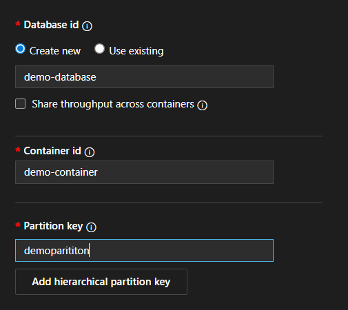
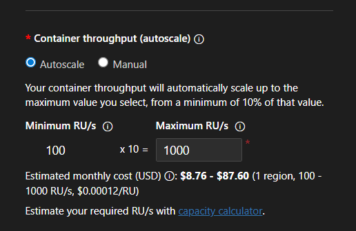

### **Container Throughput (Autoscale)**

Container Throughput defines how much performance (Request Units per second – RU/s) your container can use. In your setup, **Autoscale** is selected, which means Azure will automatically adjust the RU/s based on traffic. It can scale between 10% of the maximum value and the maximum value you set.

In your configuration, the **Maximum RU/s is 1000**, so Azure will automatically scale between **100 RU/s (minimum)** and **1000 RU/s (maximum)** depending on demand.

| Setting         | Selected Value | Purpose                                     |
| --------------- | -------------- | ------------------------------------------- |
| Throughput Mode | Autoscale      | Automatically adjusts RU/s based on traffic |
| Minimum RU/s    | 100            | Lowest performance level (10% of max)       |
| Maximum RU/s    | 1000           | Highest performance limit                   |

---

### **Estimated Monthly Cost**

The estimated cost shown is based on the selected maximum RU/s and region. Since you selected up to **1000 RU/s**, the estimated monthly cost is shown between **$8.76 – $87.60**, depending on usage. With Free Tier enabled, the first 1000 RU/s may be free (based on eligibility).

| Setting        | Value          | Purpose                                            |
| -------------- | -------------- | -------------------------------------------------- |
| Estimated Cost | $8.76 – $87.60 | Monthly estimate based on throughput configuration |

---

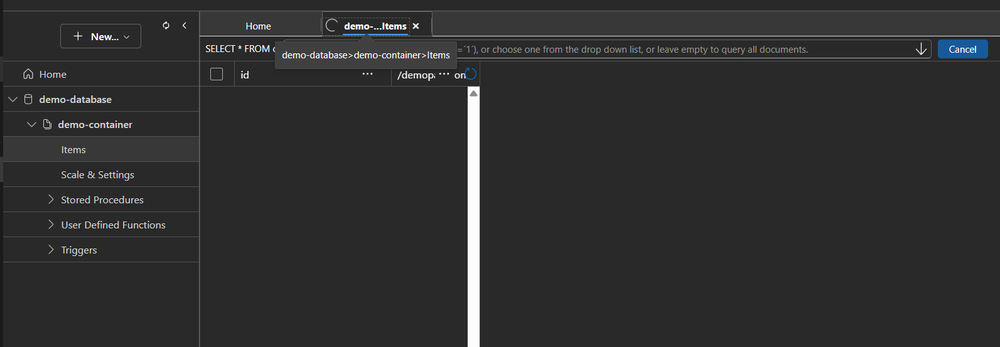

### **Items Section**

The Items section is where you can view, create, edit, and query the actual data stored inside your container. In your screenshot, you are inside **demo-database → demo-container → Items**. This is the place where all JSON documents (records) are stored and managed.

| Section   | Value          | Purpose                        |
| --------- | -------------- | ------------------------------ |
| Database  | demo-database  | Logical grouping of containers |
| Container | demo-container | Stores documents               |
| Items     | Selected       | View and manage stored data    |

---

### **Query Editor**

At the top, you can see a query window with:

`SELECT * FROM c`

This is the default SQL query used to retrieve all documents inside the container. You can modify this query to filter data based on conditions.

| Query           | Meaning                                |
| --------------- | -------------------------------------- |
| SELECT * FROM c | Returns all documents in the container |

---

### **Left Panel Options**

Below the container, you also see options like:

* Scale & Settings
* Stored Procedures
* User Defined Functions
* Triggers

These are advanced features used for scaling and server-side logic.

---

## ⭐ Adding data to the databse

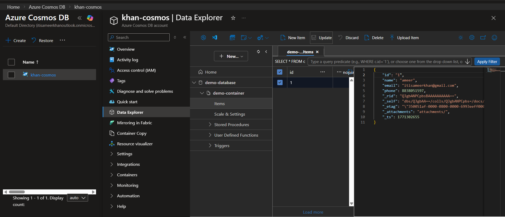

```json
{
    "id": "1",
    "name": "ameer",
    "email": "itisameerkhan@gmail.com",
    "phone": 8838051597,
    "_rid": "QJgbANPCpbsBAAAAAAAAAA==",
    "_self": "dbs/QJgbAA==/colls/QJgbANPCpbs=/docs/QJgbANPCpbsBAAAAAAAAAA==/",
    "_etag": "\"350051af-0000-0800-0000-6993eeff0000\"",
    "_attachments": "attachments/",
    "_ts": 1771302655
}
```

### **System-Generated Properties (Extra Fields Added by Azure)**

The extra fields starting with `_` are automatically added by Azure Cosmos DB. These are **system-generated properties** used internally by Cosmos DB to manage the document. You do not need to create or manage them manually. They help with identification, version control, storage, and tracking changes.

| Field          | Meaning          | Purpose                                               |
| -------------- | ---------------- | ----------------------------------------------------- |
| `_rid`         | Resource ID      | Internal unique identifier used by Cosmos DB          |
| `_self`        | Self link        | Internal path reference of the document               |
| `_etag`        | Entity tag       | Used for concurrency control (tracks version changes) |
| `_attachments` | Attachments link | Used if the document has file attachments             |
| `_ts`          | Timestamp        | Last modified time (Unix timestamp format)            |

---

### **Simple Explanation**

When you create a document like this:

```json
{
  "id": "1",
  "name": "ameer",
  "email": "itisameerkhan@gmail.com",
  "phone": 8838051597
}
```

Azure automatically adds extra metadata fields to:

* Track when it was updated
* Manage versions
* Identify it internally
* Handle attachments
* Control concurrent updates

---

### **Important Note**

* You should not modify or delete these system fields.
* They are automatically managed by Cosmos DB.
* In real applications, you mostly ignore them unless using advanced features like concurrency control (`_etag`).

---


### ✨ Query Stats

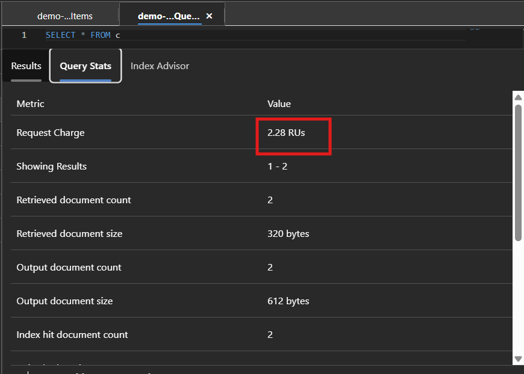

### **Query Stats**

Query Stats shows the performance details of the query you executed (`SELECT * FROM c`). It helps you understand how many Request Units (RUs) were consumed, how many documents were scanned, and how efficiently the query ran. This section is mainly used to monitor performance and cost.

| Metric                   | Value     | Meaning                       |
| ------------------------ | --------- | ----------------------------- |
| Request Charge           | 2.28 RUs  | Cost of running this query    |
| Showing Results          | 1–2       | Number of records displayed   |
| Retrieved Document Count | 2         | Documents read from storage   |
| Retrieved Document Size  | 320 bytes | Size of data read             |
| Output Document Count    | 2         | Documents returned in result  |
| Output Document Size     | 612 bytes | Size of result data returned  |
| Index Hit Document Count | 2         | Documents matched using index |

---

### **What This Means in Simple Words**

* Your query cost **2.28 RU** to execute.
* Cosmos DB read **2 documents**.
* Both were returned as results.
* The query used the index efficiently (good performance).
* The total data size was small, so RU consumption was low.

---

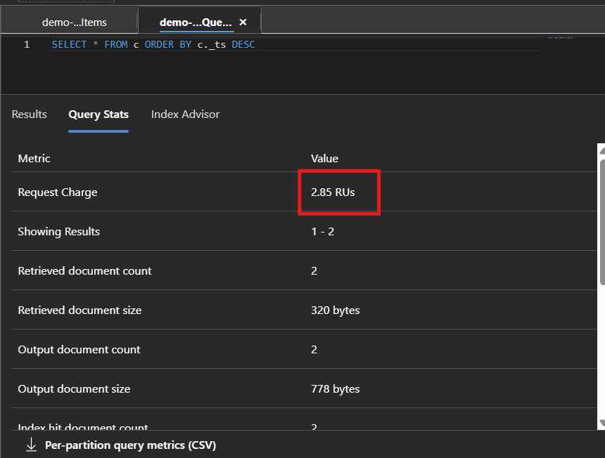 
